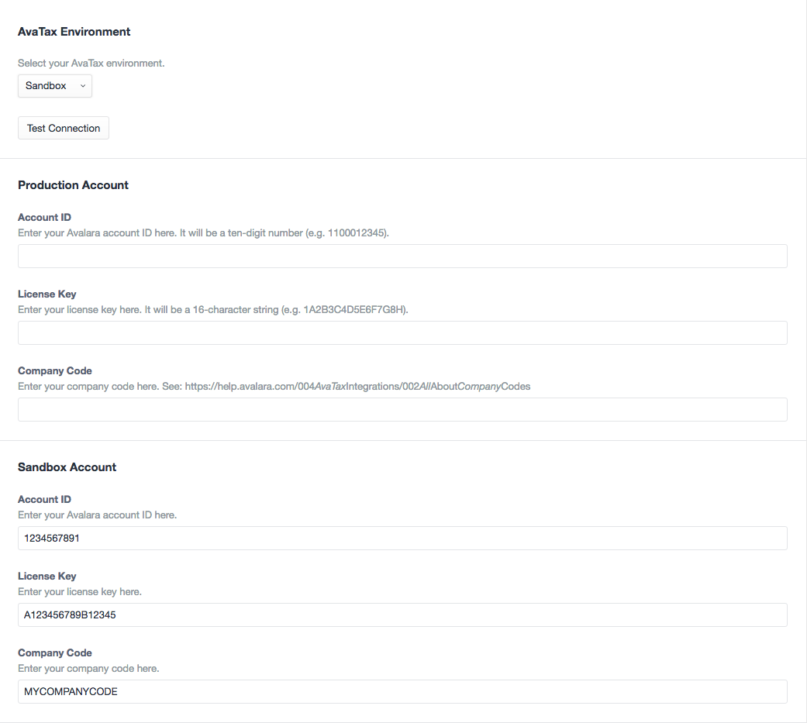
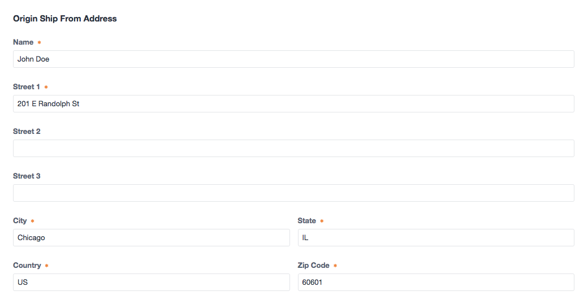
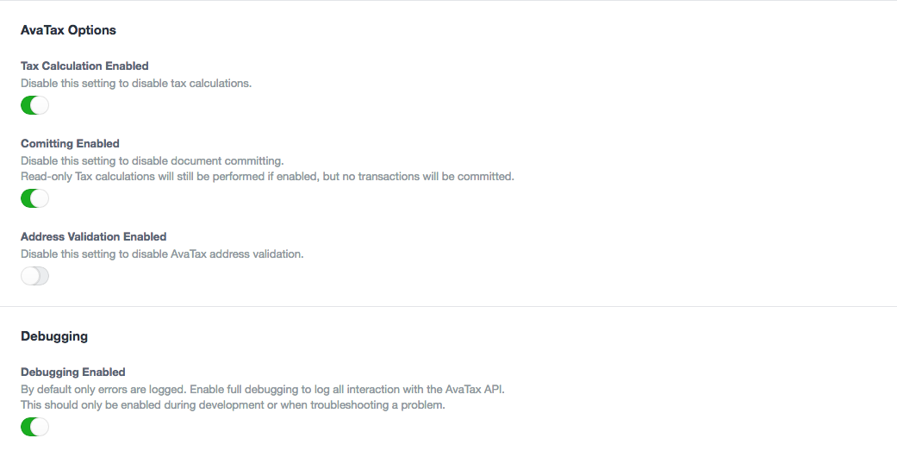
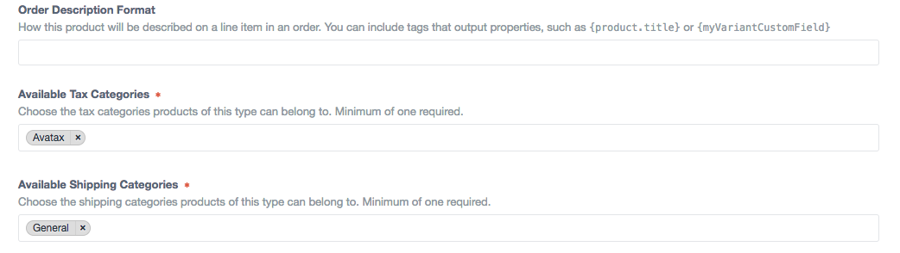
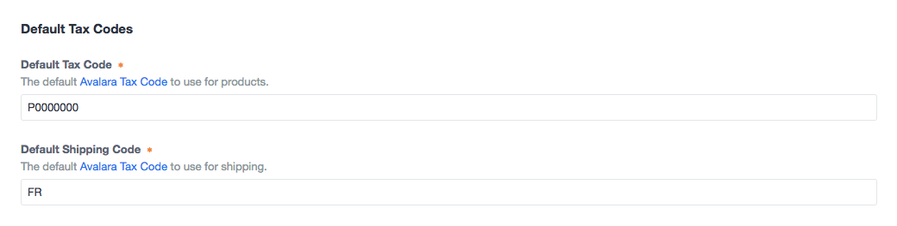
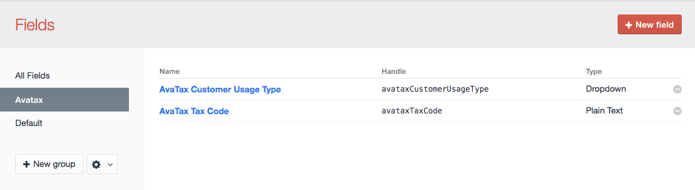
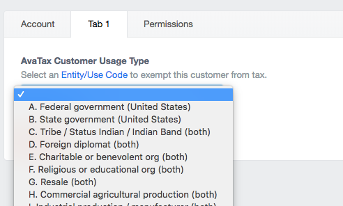

# AvaTax Tax Adjuster plugin for Craft Commerce

Calculate and add sales tax to an order's base tax using Avalara's AvaTax service.

This plugin is in beta and bugs may be present. Please document any issues you encounter at our [Github Issues](https://github.com/surprisehighway/craft-avataxtaxadjuster/issues) page.

## Installation

To install the AvaTax Tax Adjuster plugin, follow these steps:

1. Download & unzip the file and place the `avataxtaxadjuster` directory into your `craft/plugins` directory.
2. Navigate to `Settings > Plugins` and click *Install* to install plugin.

AvaTax Tax Adjuster works on Craft 2.6.x

## Setup Overview

Setup and configuration is detailed below, but here's a quick overview of what you'll need to do get started:

1. Configure the plugin settings with your Avalara account info and test the connection.
2. Configure the plugin settings with your origin address and default tax codes.
3. Set each of your Product Types to use the "Avatax" tax category.
4. Optionally add the product-specfic tax code field to your Product Type fields to allow per-product tax codes.
5. Optionally add the customer usage type field to your User fields to set up tax-exempt customers.

## Configuring AvaTax Account Connection

1. Visit the settings page at `Settings > Avatax Tax Adjuster`
2. Enter your the Account ID, License Key, and Company code credentials for each environment.
3. Selecting *Sandbox* or *Production* will enable the chosen environment.
4. Click the *Test Connection* button to verify your connection.
5. Click the *Save* button to save your settings.

## Configuring AvaTax Ship From Origin

1. Specify a valid origin address to ship from.

## Configuring AvaTax Plugin Options

1. Visit the settings page at `Settings > Avatax Tax Adjuster`
2. *Tax Calculation Enabled* - enable or disable tax calculation independantly of other settings.
3. *Committing Enabled* - enable or disable document committing.
4. *Address Validation Enabled* - enable or disable Avalara's address verification.
5. *Debugging enabled* - while setting up and testing enable debugging to log all API interactions. Be sure to disable once live.
6. Click the *Save* button to save your settings.

## Using AvaTax Tax Adjuster

1. Visit `Commerce > Settings > Tax Categories`. A tax category with the handle "avatax" should exist, if not, create one.
2. Visit `Commerce > Settings > Product Types`. For each product type to use tax rates provided by Avalara, select the AvaTax category from the "Available Tax Categories" field.

After completing the installation and configuration, AvaTax will calculate and apply sales tax to all orders with a valid shipping address.

## Tax Codes

*E.g. 'P0000000' - Tangible personal property (TPP)*.

You can set the default [Avalara Tax Code](https://taxcode.avatax.avalara.com/) by setting the Default Tax Code value in the plugin settings. This is the default tax code that will get sent to Avalara for all products.

You can also set a specific Tax Code for each product by adding a custom field to your Products.

#### To set up the product field:

1. Visit `Settings > Fields`. You should see a field named "AvaTax Tax Code" that was created during plugin installation. If not create, one. Note that the field "Name" can be anything you'd like, e.g. "AvaTax Tax Code" or "Product Tax Code", but the field "Handle" must match `avataxTaxCode` and is case sensitive.
2. Visit `Commerce > Settings > Product Types` and click the name of your Product Type.
2. Click the *Product Fields* tab.
3. Add the AvaTax Tax Code field and save.

In your product entries you can now enter any text to send along as the AvaTax Tax Code. If this field does not exist or is left empty the default tax code setting in your config file will be used. 

> Hint: By default the field is plain text, but you could change it to a dropdown with pre-configured values for your use case as long as the handle stays the same.

## Shipping Codes

*E.g. 'FR' - Shipping Only - common carrier - FOB destination.*

Shipping charges are sent as a separate line item to AvaTax. You can set your default [Avalara Tax Code](https://taxcode.avatax.avalara.com/) for shipping charges by setting the Default Shipping Code in the plugin settings.

## Tax-Exempt Customers

You can specify a customer to be exempt from tax by adding a custom field to your User settings which is used to specify an [Avalara Entity/Use Code](https://help.avalara.com/000_Avalara_AvaTax/Exemption_Reason_Matrices_for_US_and_Canada).

#### To set up the User field:

1. Visit `Settings > Fields`. You should see a field named "AvaTax Customer Usage Type" that was created during plugin installation. If not create, one. Note that the field "Name" can be anything you'd like, e.g. "AvaTax Customer Usage Type" or "Entity/Use Code", but the field "Handle" must match `avataxCustomerUsageType` and is case sensitive.
2. Visit `Settings > Users` and click the `Fields`.
3. Add the AvaTax Customer Usage Type field and save.

In your User accounts you can now set an Entity/Use Code to send to Avalara. It is up to you how you implement this for your users if you allow them to edit their own profiles on the front-end, but this will most likely remain an administrative task in most cases.

This necessarily requires a registered User to be logged in during checkout, not guest checkouts.

> Hint: By default this dropdown field contains all the default Avalara Entity/Use Codes but you can edit the options to customize for own use case or if you’ve set up custom codes via the AvaTax website.

## Refunds

Craft Commerce only supports refunds for completed transactions if the [payment gateway](https://craftcommerce.com/support/which-payment-gateways-do-you-support) supports refunds. If refunds are supported for an order Craft displays a "Refund" button in the order’s Transaction history. Triggering a refund in this way will issue a new Return Invoice for full amount of the corresponding AvaTax transaction.

Partial refunds, returns, or any other changes must be done manually via the AvaTax website.

## Config Overrides

You can use Craft's [plugin config file](https://docs.craftcms.com/v2/plugins/plugin-settings.html#config-file) support to override many of the plugin settings in the control panel. This is handy to "lock down" certain settings, and also to provide [per-environment settings](https://docs.craftcms.com/v2/multi-environment-configs.html).

1. Copy `config.example.php` from the `avataxtaxadjuster` directory to your craft/config folder and rename it to `avataxtaxadjuster.php`
2. Update values in `avataxtaxadjuster.php` and save.

## AvaTax Tax Adjuster Roadmap

Some things to do, and ideas for potential features:

* Enable/Disable tax calculation on a per-product basis.
* Config settings for default tax codes at the Product Type level.

---

Brought to you by [Surprise Highway](https://github.com/surprisehighway)
